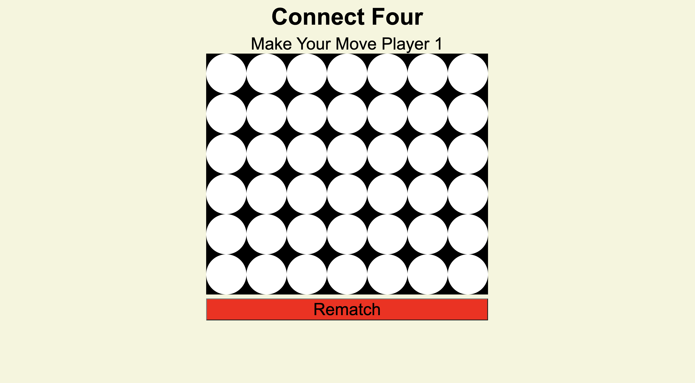
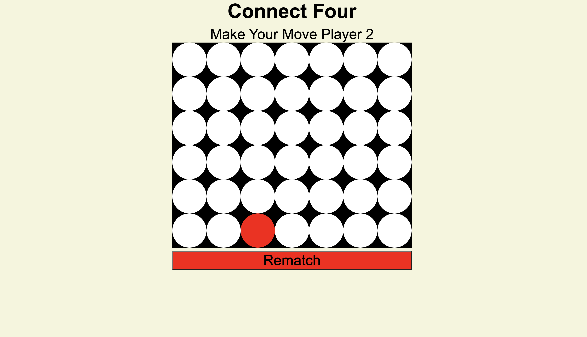
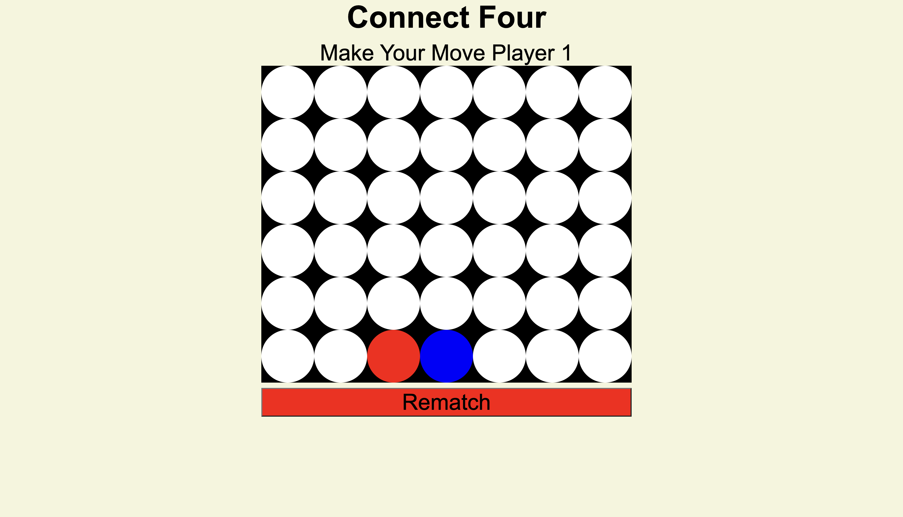
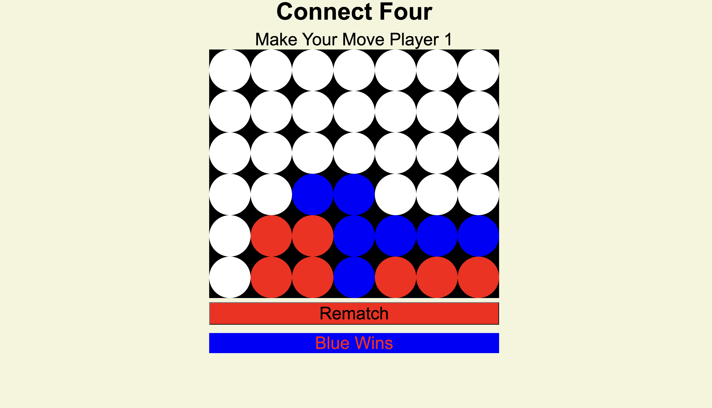

# ConnectFour
An MVP representation of a childhood-favorite where the players take turns lighting up their colors starting from the bottom-most empty columns in order to CONNECT FOUR.

1. Opening Screen shows empty game board with current player set to 1 (first player) as well as a title “Connect Four”.

2. Player makes first move which signals to the computer the game has begun.

3. Computer makes  its move after receiving the signal that player 1 has made a move. The computer goes over all possible options and make decision on where to place its token. 

4. Repeat steps above until four in a row has been reached.

5. Once the computer reads the function stating what determines a winner to be "true", the browser will declare a winner message.
    5a. Else, if no winner is declared a “draw” message will appear and result in a rematch.

TECHNOLOGIES USED:
    HTML, CSS, and javaScript are utilized in this project and produced via Mac.

